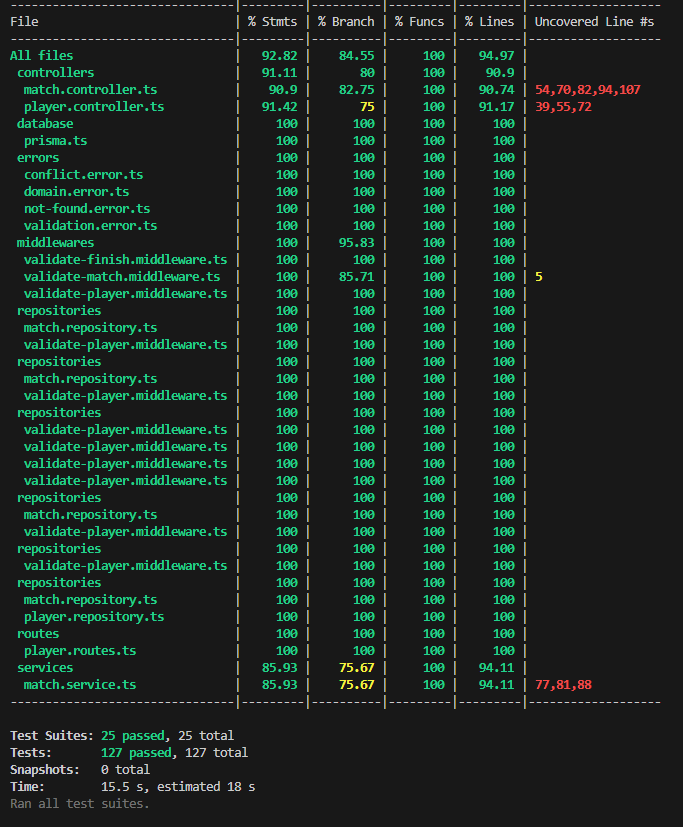

# 🎮 Multiplayer API

Este projeto trata-se de uma avaliação prática para vaga de desenvolvedor backend. O produto do projeto é uma API REST para gerenciar partidas multiplayer, permitindo efetuar o CRUD de jogadores, criar partidas, adicionar/remover jogadores, iniciar e finalizar partidas com pontuações.

O tempo gasto para desenvolvimento do mesmo foi de cerca de 22 horas no período de 5 dias. Podendo ser melhor detalhadas da seguinte maneira:
 - Início do projeto, configuração e desenvolvimento das features: ~10hrs;
 - Concepção e ajustes da pipeline: ~5hrs;
 - Confecção dos testes unitários e de integração: ~5hrs;
 - Pequenos refinos e documentação (README): ~2hrs;

## 🚧 Desafios Encontrados e Decisões Técnicas

Durante o desenvolvimento, optei inicialmente pelo uso do **SQLite** por sua praticidade em ambiente local. Contudo, ao decidir implementar uma **pipeline automatizada de CI/CD** com deploy na plataforma **Render**, surgiram limitações relacionadas ao uso do SQLite no ambiente de produção — especialmente na aplicação de **migrations** e acesso concorrente ao banco.

Para contornar esses obstáculos e garantir uma experiência mais fluida para a equipe avaliativa (possibilitando testes diretamente no navegador), tomei a iniciativa de **migrar para o PostgreSQL**, configurando um banco de dados remoto na nuvem.  

Embora a entrega da esteira de CI/CD **não fosse um requisito da avaliação**, decidi incluí-la como diferencial, por entender que é uma prática amplamente adotada no mercado e representa um ganho real em automação, segurança e facilidade de testes.

---

## **📌 Tecnologias**
| Tecnologia       | Versão        |
|------------------|---------------|
| Node.js          | v18+ (recomendado) |
| Express          | `^5.1.0`      |
| TypeScript       | `^5.8.3`      |
| Prisma ORM       | `^6.12.0`     |
| PostgreSQL (pg)  | `^8.16.3`     |
| Swagger UI       | `swagger-jsdoc` `^6.2.8` + `swagger-ui-express` `^5.0.1` |
| Jest             | `^30.0.5`     |5`

---

## **🚀 Funcionalidades**
- **Jogadores (Players):**
  - Criar jogador.
  - Listar jogadores.
  - Buscar jogador por ID.
  - Atualizar informações de um jogador.
  - Remover jogador.

- **Partidas (Matches):**
  - Criar uma partida.
  - Listar partidas.
  - Adicionar até 4 jogadores em uma partida.
  - Remover jogadores de uma partida.
  - Iniciar uma partida.
  - Finalizar uma partida com pontuações (`scores`).

---

## **📂 Estrutura de Pastas**
```
src/
 ├── config/         # Configuração Swagger
 ├── controllers/    # Controllers das requisições HTTP
 ├── database/       # Instância e configuração de conexão com o banco de dados
 ├── erros/          # Middlewares para tratamento de erros
 ├── middlewares/    # Middlewares para validações e tratamento de requisições
 ├── repositories/   # Acesso ao banco via Prisma
 ├── routes/         # Definições das rotas
 ├── services/       # Contém a lógica de negócio
 ├── types/          # Arquivos de tipagem 
 ├── app.ts          # Configuração principal do servidor
prisma/
 ├── migrations/     # Histórico das migrações aplicadas ao banco
 ├── schema.prisma   # Definição do schema do banco de dados
tests/
 ├── integration/    # Testes de integração
 ├── unit/           # Testes unitários
```

---

## **⚙️ Configuração do Ambiente**
### **1. Clonar o repositório**
```bash
git clone https://github.com/karinewagner/multiplayer-api.git
cd multiplayer-api
```

### **2. Instalar dependências**
```bash
npm install
```

### **3. Configurar variáveis de ambiente**
Cria um arquivo `.env` na raiz do projeto:
```env
cp .env.example .env
```

### **4. Configurar banco de dados**
Gerar o banco e as tabelas via Prisma:
```bash
npx prisma migrate dev
npx prisma generate
```

### **5. Rodar o servidor**
```bash
npm run dev
```

O servidor estará disponível em:  
**http://localhost:3000**

O Swagger estará disponível em:  
**http://localhost:3000/api-docs**

---
## **🌐 API hospedada (Render)**
Este projeto incorpora práticas de DevOps ao integrar uma pipeline de Integração Contínua e Entrega Contínua (CI/CD). A cada novo commit no repositório, o pipeline executa os testes (unitário e de integração) e atualizações, disponibilizando automaticamente uma nova versão da API na plataforma Render. Isso elimina a necessidade de execução local e garante entregas rápidas, confiáveis e rastreáveis.

🔗 Swagger: **https://multiplayer-api.onrender.com/api-docs/**

>OBS: Como a API está hospedada em uma plataforma gratuita (Render), a instância pode entrar em modo de hibernação após um período de inatividade. Nesse caso, o primeiro acesso pode levar alguns segundos para que o serviço seja reativado. Aguarde até o carregamento completo da página.
---

## **🧪 Rotas Principais**
### **Players**
- **POST** `/players` – Criar jogador.
- **GET** `/players` – Listar jogadores.
- **GET** `/players/:id` – Buscar jogador por ID.
- **PUT** `/players/:id` – Atualizar jogador.
- **DELETE** `/players/:id` – Remover jogador.

### **Matches**
- **POST** `/matches` – Criar partida.
- **POST** `/matches/:matchId/join/:playerId` – Adicionar jogador na partida.
- **POST** `/matches/:matchId/leave/:playerId` – Remover jogador da partida.
- **POST** `/matches/:matchId/start` – Iniciar a partida.
- **POST** `/matches/:matchId/finish` – Finalizar partida com `scores`

---
## **📖 Cobertura de testes**
Abaixo está o relatório de cobertura de testes gerado automaticamente, demonstrando a abrangência dos testes unitários e de integração implementados no projeto:



> A cobertura é verificada a cada execução da pipeline CI/CD, garantindo a confiabilidade contínua do código.
---

## **📜 Licença**
Este projeto é de uso livre para estudo e melhorias.
